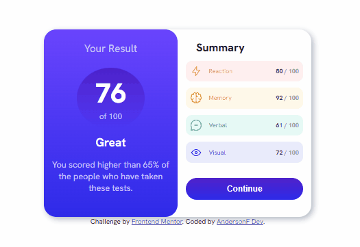
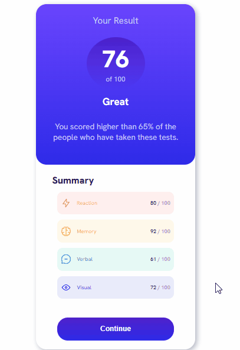

# Frontend Mentor - Results summary component solution

Esta é uma solução para o [Resumo dos resultados do desafio do componente no Frontend Mentor](https://www.frontendmentor.io/challenges/results-summary-component-CE_K6s0maV). Os desafios do Frontend Mentor ajudam você a melhorar suas habilidades de codificação construindo projetos realistas.


### Screenshot
Desktop-preview
[]

Mobile-preview
[]


### Link


- URL do site ativo: [link aqui](https://andersonf-dev.github.io/blog-preview-card/)


### Criado com

- Marcação HTML5 semântica
- Propriedades personalizadas CSS
- Flexbox


### O que aprendi

Aprendi a criar uma página responsiva, posicionar elementos na tela centralizar


```css

@media(max-width: 625px) {
    body {
        display: flex;
        max-height: 100vh;
    }
    .conteiner-card {
        display: flex;
        justify-content: center;
        align-items: center;
        flex-direction: column;
        width: 299px;
        height: 650px;
    }
}

body {
    
    font-size: 1rem; 
    font-family: "Hanken Grotesk", sans-serif;                   
    height: 100vh;
    display: flex;
    flex-direction: column;
    justify-content: center;
    align-items: center;
}
```

### Desenvolvimento contínuo

Este é apenas o quarto de muitos dos projetos de front end que fiz. Continuarei fazendo e me desenvolvendo ainda mais. Estou aprendendo cada dia mais, fazendo esses desafios, estou fazendo sempre só. 
Sem consultar na internet para praticar mesmo o que aprendi até agora, a sim, eu acho que o conteúdo grava melhor na mente. Os desafios fazem as pessoas crescerem na vida e profissionalmente. Que venha o próximo desafio.
